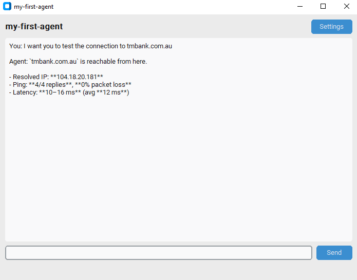

# my-first-agent

A minimal conversational AI agent powered by the OpenAI Responses API. It ships with a modern GUI (CustomTkinter) that can be packaged into a standalone Windows `.exe`, and also works as a plain terminal REPL.

## Requirements

- Python 3.10+
- An OpenAI API key

## Setup

Install dependencies:

```bash
pip install openai python-dotenv customtkinter
```

## Usage

### GUI (recommended)

```bash
python gui.py
```

On first launch you will be prompted for your OpenAI API key. The key is saved to `%APPDATA%/my-first-agent/config.json` so you only need to enter it once. You can update it later via the **Settings** button in the top-right corner.

Type a message in the input bar and press **Enter** (or click **Send**). The agent responds in the chat area. A "Thinking..." indicator appears while the model is working.



### Terminal

```bash
python agent.py
```

Requires a `.env` file in the project root:

```
OPENAI_API_KEY=your-key-here
```

## How It Works

The agent maintains a conversation context and sends it to the OpenAI Responses API on each turn. When the model decides a tool is needed, the agent executes the tool locally, feeds the result back to the model, and lets the model produce a final response.

```
User input  -->  Model  -->  Tool call?  --yes-->  Execute locally  -->  Model summarizes
                                \--no-->  Direct text response
```

## Tools

The model can request the following tools during a conversation:

| Tool | Parameters | Description |
|---|---|---|
| `ping` | `host` (string) — hostname or IP address | Pings a host on the internet (4 packets, 15 s timeout) and returns the output. The ping runs locally on your machine via `subprocess`. |

## Building the Executable

Install PyInstaller:

```bash
pip install pyinstaller
```

Build a single-file `.exe` (no console window):

```bash
pyinstaller --onefile --windowed --name my-first-agent --hidden-import openai --hidden-import customtkinter gui.py
```

The output binary will be at `dist/my-first-agent.exe`. Double-click it to launch the GUI.

## Project Structure

```
my-first-agent/
├── .env           # API key for terminal mode (git-ignored)
├── .gitignore
├── agent.py       # Agent core — importable module + terminal REPL
├── gui.py         # CustomTkinter chat window + API key management
└── README.md
```
